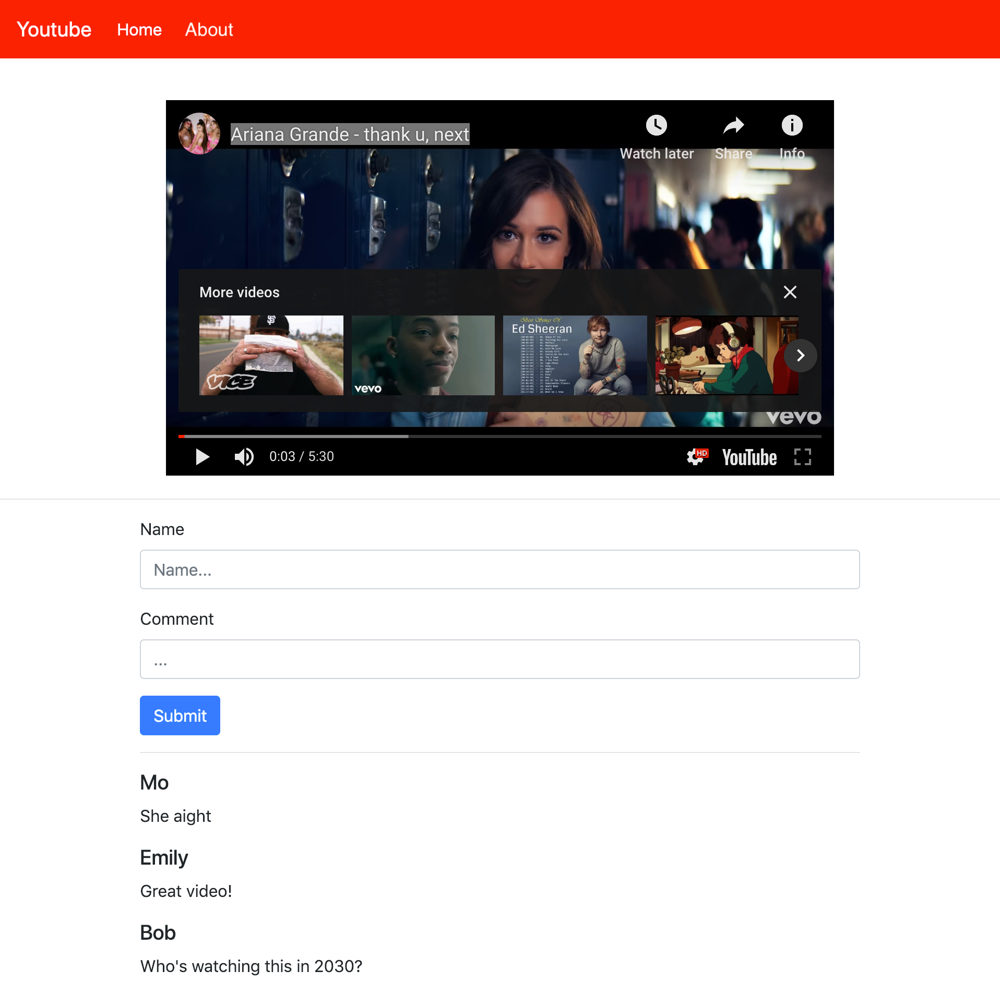

# React YouTube Project

In this project, you will create a YouTube clone that lets you search for videos using the YouTube API. Then, you'll be able to select a video and watch it.

Building this application will be a team effort that will require you to collaborate with at least one other classmate. You will build the application leveraging your knowledge of React and utilizing your design skills.

## Project scoring

This project has five different parts on which you will be graded. Each part is weighted differently.

- 50% of the project is scored on **completion**.
- 20% of the project is scored through the **mastery rubric**.
- 10% of the project is scored through **stretch goals**.
- 20% of the project is scored through the **teamwork rubric**.

In total, you must receive at least 70% to complete this project. For example, you could attain 35% of points through the completion requirements, 15% of points through the mastery rubric, 15% of points through the teamwork rubric, and 5% of points through the stretch goals.

> **Note**: Your contributions to this group project must be equitable. Failure to make meaningful individual contributions to this project may lead to a separate assessment of some kind or a failing grade.
>
> Please also note that team members should work _across_ the stack. One team member should not be solely responsible for the front-end application, for example.

### Completion

To complete this project, you will need to build a React application that meets the following feature and technical requirements.

#### Overall requirements

1. Create a GitHub repository for the front-end application and upload your code to it.
1. Your front-end application should be successfully deployed to the web.
1. Your front-end repository should have a `readme.md` file with setup instructions for your application. Your `readme.md` file should also include a link to your deployed application.

#### Feature requirements

To complete this application, you will need to build a React application that allows for viewing and searching of videos.

4. A Home page should exist, which includes a search bar and prompts the user to search for videos on load.
1. An About page should exist, which should include information about who worked on the application and links to their GitHub profiles.
1. A navbar should appear on every page that includes links to the Home page and the About page.
1. Upon using the Home page's search bar, the user should be presented with the first 8 videos that return from the YouTube API. A thumbnail from the video should be shown as well as the title of the video.
1. If a new search is performed on the Home page, the previous results should be cleared and new results should be shown.
1. When a user clicks on a displayed video, they should be brought to a new page with a new URL specific to that video. This is the video's Show page.
1. On the Show page, the user should be able to see a larger version of the video and be able to play it.
1. On the Show page, a form should exist with two fields: name and comment. When a user fills out the form and submits it, A comment should appear on the page.
1. If a user leaves either the name or comment field blank, an error message should be shown and a comment should not be created.
1. React Router 6.2.1 should be used to navigate views/pages.
1. Responsive CSS should be used. You may, optionally, use [Bootstrap](https://getbootstrap.com/docs/4.3/getting-started/introduction/)

### Mastery rubric

This section of the project is designed to measure your increasing skill at writing good code and following best practices.

To view components of the mastery rubric, view the appropriate assignment on Canvas.

### Stretch goals

This section of the project measures your ability to go above and beyond in creating your project. To score points in this section, you should incorporate a feature, technology, or skill not explicitly required by the project instructions.

When you submit your pull request, _make sure to include a description of any stretch goals you implemented._ You may choose from the list below or come up with features or tasks that are more relevant to your specific implementation of the project.

- Allow for videos to be "favorited." Favorited videos should be displayed on their own page.
- Keep tabs on what searches have previously been made and show them below the search bar or in a Sidebar.
- Track which Show pages have been visited and create a History page that shows all previously viewed videos.
- Implement [LocalStorage](https://developer.mozilla.org/en-US/docs/Web/API/Window/localStorage) to persist data, so that the data does not disappear upon refreshing.
- Include more user-set search criteria such as a maximum number of results or in what order the videos should be displayed.

Points will be allocated in this section at the discretion of the instructor.

### Teamwork rubric

This section of the project is designed to allow you and your teammate(s) to self-reflect on what it was like working in a group with one another. These skills are critical for succeeding in the course and thriving as a software developer.

To view components of the teamwork rubric, view the appropriate assignments on Canvas.

## Project setup and overview

There are no tests for this project and you _should not_ fork and clone this repository. Instead, create your own repositories with your group member(s).

## Using the YouTube API

You can find instructions on how to use the YouTube API at the link below.

- [YouTube API Key Instructions](./youtube-api-key.md)

## Example application

The following screenshots are from an example application. You do not need to make your application look exactly like the images below but you must include the same features.

### Home page on load

### Home page on search

### Show page

